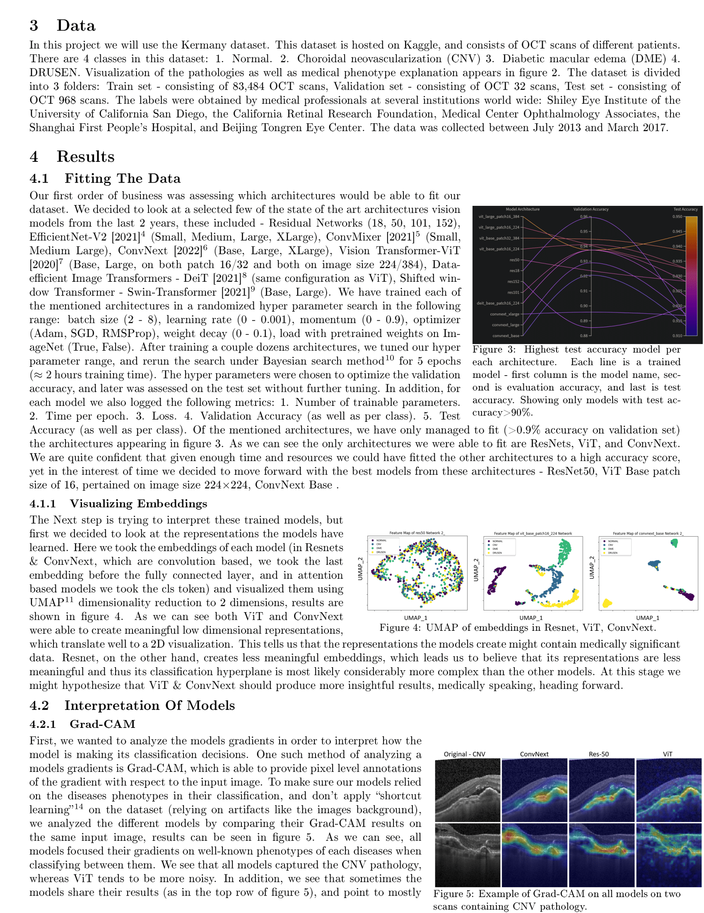
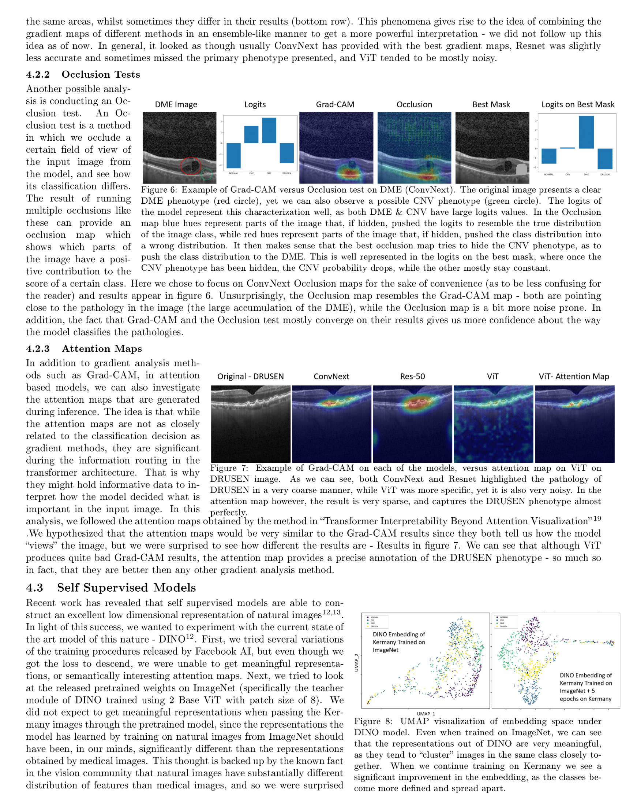
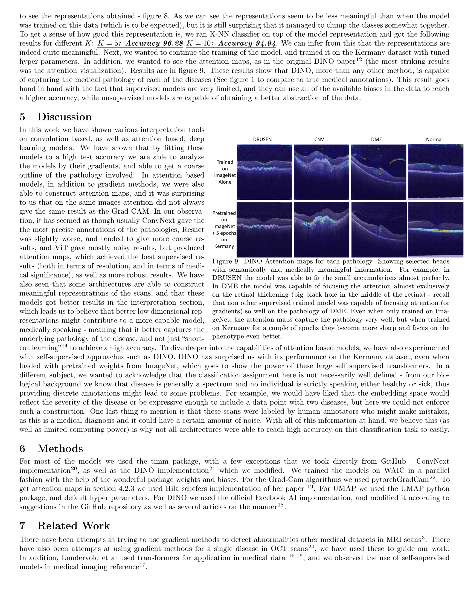
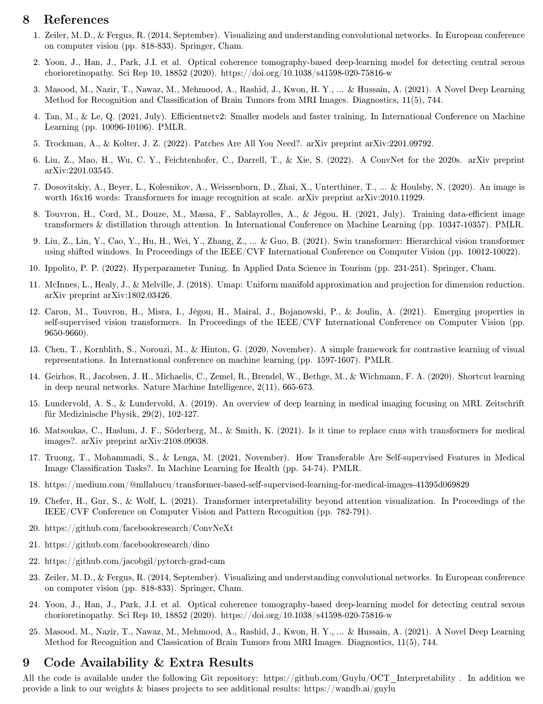

# OCT_Interpretability
Project for Weizmann institute course: Deep Learning For Computer Vision.

Using OCT dataset provided by Kermany, we investigate differant deep learning methods (mostly transformers) and their application in medical imaging.
We fit several architectures on the data in a supervised fashion, and interpret the models using Grad-CAM, Occlusion tests, and review the attention maps.

In addition we look into the self supervised model called DINO (by FAIR), and investigate the usages of self supervised models in medical imaging ( transfer learning from ImageNet to Kermany dataset)

Check out video explaining the project of Youtube ***(use captions on :nerd_face:)***:

*
*
*
* Short Explanation About The Project:  **https://www.youtube.com/watch?v=97NHk06N5uY**
*
*
*
*

Quick demonstration of how Vision models (in the example: ConvNext - A ConvNet for the 2020s [2022] ) learn a latent representation of the Kermany Retinal OCT scans dataset:

  

<!--

-->

#Presenting our paper on OCT interpetability in deep learning

  

  

  

  

  

Some additional results can be viewed on my weights & biases server :
https://wandb.ai/guylu
